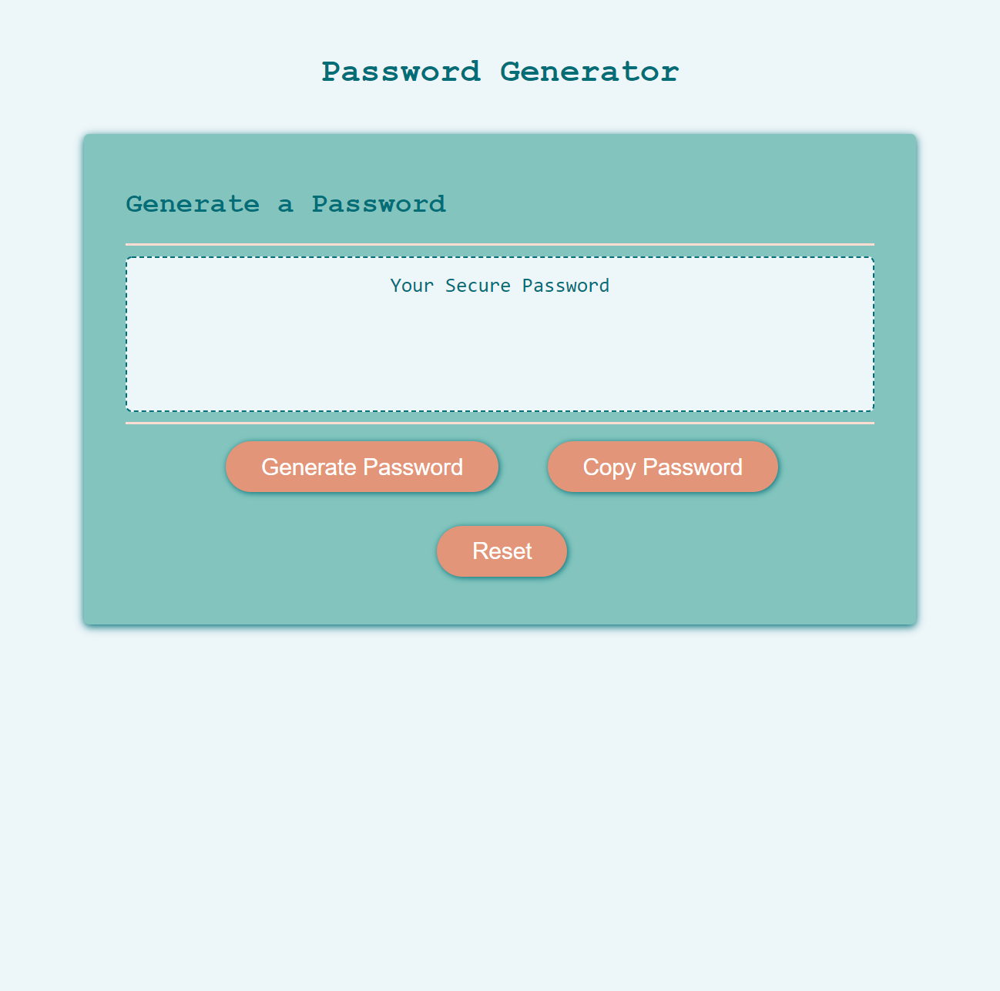

# 03 JavaScript: Password Generator

## Summary

The password generator will compute a random password based on the following criteria:

* Password length (between 8 and 128 characters)
* Whether or not you want to include:
    * Lowercase letters
    * Uppercase letters
    * Numbers
    * Special characters

## Key Features

Key features of the password generator include:

* Data validation for each prompt
* Copy feature that will copy the password you generated
* Reset feature that allows you to clear the password you generated
* Asthetically pleasing color scheme

## Link to Deploy

[Password Generator](https://leighdahlin.github.io/leigh-dahlin-homework3/)

## Screenshot

